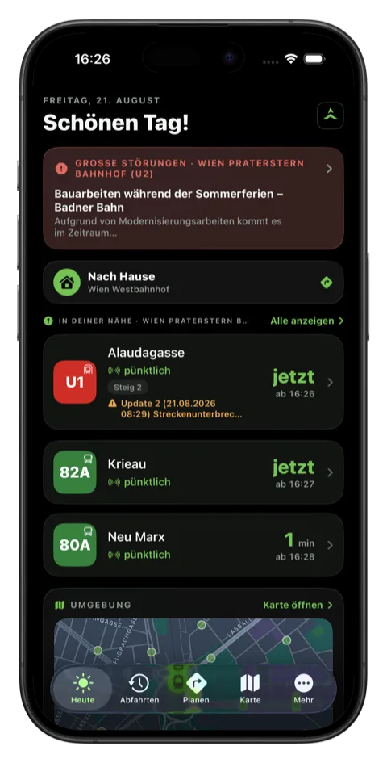
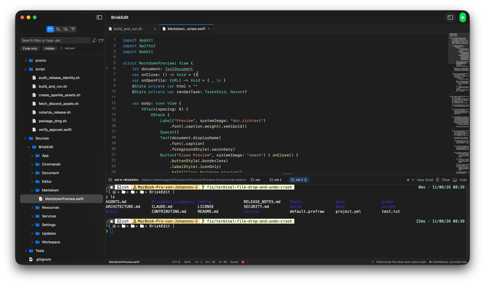

<picture>
  <source media="(max-width: 600px) and (prefers-color-scheme: dark)" srcset="assets/header-mobile-dark.svg">
  <source media="(max-width: 600px)" srcset="assets/header-mobile-light.svg">
  <source media="(prefers-color-scheme: dark)" srcset="assets/header-dark.svg">
  
</picture>

# Servus, I'm Johannes.

I'm a student developer at **HTBLA Kaindorf** in Austria. I build native Mac and iPhone apps,
small developer tools, and the backends that keep them running.

Most of my time currently goes into **ÖffiGo**. The side projects range from a text editor
to bringing an old hi-fi system back online. I like digging into how things work,
and I'm learning more Rust and TypeScript as I go.

## Taking the next connection

### ÖffiGo

**Public transport across Austria, built for iPhone and Apple Watch.**

Departures, journey planning and disruptions, with your trip on your wrist
and in a Live Activity. A native SwiftUI app, backed by my own TypeScript server.

Currently in a **closed TestFlight beta**. Android development is paused.

`SwiftUI` `WidgetKit` `ActivityKit` `TypeScript`

**[Explore the app & join the waitlist →](https://oeffigo.app)**

Primary data source: Verkehrsauskunft Österreich (VAO), supporting ÖffiGo as a student project.

## A few things I've built

### [BriskEdit](https://github.com/jx-grxf/BriskEdit)

A native Mac text editor with a terminal, Markdown preview and local language-server support.
Built with SwiftUI, AppKit and TextKit 2.

**[Download](https://github.com/jx-grxf/BriskEdit/releases/latest)** · **[Watch the demo](https://github.com/jx-grxf/BriskEdit#showcase)**

| | |
| :--- | :--- |
| **[agent-presence](https://github.com/jx-grxf/agent-presence)** Discord Rich Presence for Claude Code and Codex. One Rust binary, across macOS, Windows and Linux.  `Rust` · `CLI` · `Discord` | **[MacPhone](https://github.com/jx-grxf/MacPhone)** A little device lab: bridge a real Bluetooth LE device into an Android emulator from your Mac.  `Swift` · `CoreBluetooth` · `Android` |
| **[Caruso-Reborn](https://github.com/jx-grxf/Caruso-Reborn)** Bring internet radio and local playback back to first-generation T+A Caruso hi-fi systems.  `TypeScript` · `UPnP` · `Audio` | **[Tools](https://tools.johannesgrof.me)** Merge, split and convert PDFs and images in your browser. Files stay on your device.  `TypeScript` · `Vite` · `Browser APIs` |

<b>More apps, experiments & rabbit holes</b>

| Project | The idea |
| :--- | :--- |
| [poise](https://github.com/jx-grxf/poise) | Use AirPods motion sensors as an on-device posture coach. |
| [NotchTray](https://github.com/jx-grxf/NotchTray) | Surface menu bar items hidden behind the MacBook notch. |
| [BottleLite](https://github.com/jx-grxf/BottleLite) | A lightweight macOS runner for Windows apps. |
| [CCrab](https://github.com/jx-grxf/CCrab) | A native desktop companion that reacts to Claude Code sessions. |
| [claude-swap-bar](https://github.com/jx-grxf/claude-swap-bar) | Switch Claude Code accounts and see usage from the menu bar. |
| [PatchPilot](https://github.com/jx-grxf/PatchPilot) | A terminal coding agent with visible, permissioned repository changes. |
| [ip-multitool](https://github.com/jx-grxf/ip-multitool) | IP intelligence, DNS, RDAP and network diagnostics in the terminal. |
| [scooter-tuning-db](https://github.com/jx-grxf/scooter-tuning-db) | Community-documented BLE registers and tuning maps for e-scooters. |
| [johannesgrof.me](https://github.com/jx-grxf/johannesgrof.me) | My bilingual portfolio, built with Astro and TypeScript. |

Also on my workbench: **PortPirate**, a Mac menu bar tool for local dev ports,
and **HealthKit-MCP**, an Apple Health bridge for AI tools. Their source is private.

[Browse all public repositories →](https://github.com/jx-grxf?tab=repositories)

## Latest departures

Recent public releases from a selection of my projects.

<picture>
  <source media="(max-width: 600px) and (prefers-color-scheme: dark)" srcset="assets/releases-mobile-dark.svg">
  <source media="(max-width: 600px)" srcset="assets/releases-mobile-light.svg">
  <source media="(prefers-color-scheme: dark)" srcset="assets/releases-dark.svg">
  
</picture>

<!-- releases:start -->
- **[BriskEdit v0.6.0](https://github.com/jx-grxf/BriskEdit/releases/tag/v0.6.0)** · 2026-09-05
- **[agent-presence v0.3.0](https://github.com/jx-grxf/agent-presence/releases/tag/v0.3.0)** · 2026-09-05
- **[NotchTray v1.0.0](https://github.com/jx-grxf/NotchTray/releases/tag/v1.0.0)** · 2026-08-02
- **[poise v0.1.0](https://github.com/jx-grxf/poise/releases/tag/v0.1.0)** · 2026-07-18
<!-- releases:end -->

## What I work with

  
  
  
  
  
  
  
  

| | Stack |
| :--- | :--- |
| **Native apps** | Swift · SwiftUI · AppKit · WidgetKit · ActivityKit |
| **Backend & web** | TypeScript · Node.js · Astro |
| **Data & hosting** | PostgreSQL / Supabase · Redis · Cloudflare · Railway · Vercel |
| **Development** | Xcode · Git · GitHub Actions · Tuist · Playwright |

**Currently going deeper:** [Rust](https://github.com/jx-grxf/rust_learning) and
[TypeScript](https://github.com/jx-grxf/typescript_learning). Learning by building, breaking things, and understanding the fix.

Also worked with

Python · C · Java · JavaScript · Kotlin / Jetpack Compose · Electron · Docker · Linux · AWS · MCP · Sparkle

## GitHub activity

<picture>
  <source media="(prefers-color-scheme: dark)" srcset="https://github-stats-extended.vercel.app/api?username=jx-grxf&amp;show_icons=true&amp;hide_border=true&amp;theme=dark&amp;hide_rank=true">
  
</picture>

---

**Have something in mind?** I'm available for freelance websites, small tools, automation and IT support.
On-site in south-east Styria, remote across Austria.

**[Let's talk →](mailto:contact@johannesgrof.me)** · [johannesgrof.me](https://johannesgrof.me)
