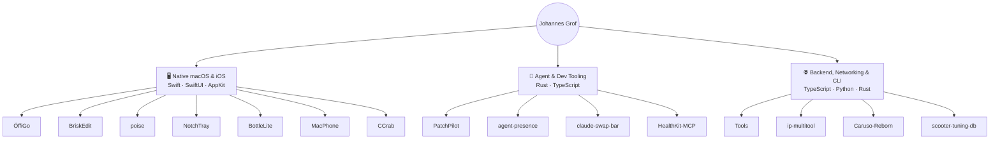

# Johannes Grof

**I build native macOS and iOS apps, developer tools, and the backends behind them.**

Austria · HTBLA Kaindorf an der Sulm · Swift · TypeScript · Rust

---

## Currently building — ÖffiGo

> **A truly native public transport app for all of Austria.** Real-time departures, journey
> planning, live vehicle positions and disruptions — on iOS (SwiftUI), Android (Jetpack Compose)
> and Apple Watch, backed by my own TypeScript BFF.
>
> Primary data source: **Verkehrsauskunft Österreich (VAO)** - the national mobility data
> platform behind Austria's official transit apps.
>
> **[oeffigo.app](https://oeffigo.app)** · closed TestFlight beta · Android in development

`SwiftUI` · `Jetpack Compose` · `TypeScript` · `Supabase` · `Redis` · `Cloudflare` · `Railway` · `Live Activities` · `Apple Intelligence`

---

## What I build

---

## macOS apps

| Project | Tech | What it does |
|:---|:---|:---|
| ✏️ **[BriskEdit](https://github.com/jx-grxf/BriskEdit)** |   | Native developer text editor. SwiftUI + AppKit, TextKit 2, Swift 6 — built against the Electron VS Code experience. |
| 🧍 **[poise](https://github.com/jx-grxf/poise)** |   | Turns your AirPods into a posture coach using their motion sensors. No camera, no cloud, fully on-device. |
| 📲 **[NotchTray](https://github.com/jx-grxf/NotchTray)** |   | Finds menu bar items hidden behind the MacBook notch and surfaces them in a Dynamic Island-style panel. |
| 🍾 **[BottleLite](https://github.com/jx-grxf/BottleLite)** |   | Lightweight open-source macOS runner for Windows apps. |
| 🔀 **[claude-swap-bar](https://github.com/jx-grxf/claude-swap-bar)** |   | Switch between Claude Code accounts from the menu bar, with live per-window usage meters. |
| 🦀 **[CCrab](https://github.com/jx-grxf/CCrab)** |   | Desktop companion for Claude Code. Live session state on a floating panel and usage limits in the menu bar, at **0.0% idle CPU** — Core Animation owns the timeline, so there is no draw loop. |
| 📱 **[MacPhone](https://github.com/jx-grxf/MacPhone)** |   | macOS device lab that bridges a *real* BLE device into an Android emulator's virtual controller. |

---

## Developer &amp; agent tooling

| Project | Tech | What it does |
|:---|:---|:---|
| 🦀 **[agent-presence](https://github.com/jx-grxf/agent-presence)** |     | Discord Rich Presence for Claude Code and Codex. One ~1.5 MB static binary, no bot token, privacy-safe defaults. |
| 🛠️ **[PatchPilot](https://github.com/jx-grxf/PatchPilot)** |   | Local-first terminal coding agent. Inspect, plan and apply changes with explicit permissions for every file write and shell command. |
| ❤️ **[HealthKit-MCP](https://github.com/jx-grxf/HealthKit-MCP)** |   | Read-only MCP bridge for Apple Health — sleep, workouts and training load for any MCP-capable agent. |
| 🧰 **[ip-multitool](https://github.com/jx-grxf/ip-multitool)** |  | Terminal toolkit for IP intelligence, DNS/RDAP, HTTP checks, subnet math and authorized network diagnostics. |

---

## Web, hardware &amp; open data

| Project | Tech | What it does |
|:---|:---|:---|
| 🌐 **[johannesgrof.me](https://github.com/jx-grxf/johannesgrof.me)** |   | My portfolio and project site. Bilingual (EN/DE), static, fast. |
| 🧾 **[Tools](https://github.com/jx-grxf/tools)** |   | Merge, split, rotate and convert PDFs and images entirely in the browser — no upload, no account. Live at **[tools.johannesgrof.me](https://tools.johannesgrof.me)**. |
| 📻 **[Caruso-Reborn](https://github.com/jx-grxf/Caruso-Reborn)** |   | Brings internet radio and modern sources back to first-generation T+A Caruso hi-fi systems over UPnP. |
| 🛴 **[scooter-tuning-db](https://github.com/jx-grxf/scooter-tuning-db)** |   | Open, community-reverse-engineered BLE register and tuning map database for e-scooters. |

---

## Coming soon

| Project | Tech | Status |
|:---|:---|:---|
| 🧰 **PortPirate** |  | macOS menu bar control center for local dev ports — maps every listener to its process and repo. |
| ⌨️ **TypeBot** |   | Stay tuned 👀 |

---

<b>📦 Archive</b> — unmaintained projects &amp; forks

 

> [!NOTE]
> These repositories are no longer maintained. They stay public for reference,
> but expect no fixes, releases, or support.

| Project | Tech | Description |
|:---|:---|:---|
| 🔊 [SlamX](https://github.com/jx-grxf/SlamX) |  | Want to make your MacBook scream? Fan and thermal control experiment. |
| 📄 [DocxToPDF](https://github.com/jx-grxf/DocxToPDF) |  | Batch convert DOCX to PDF on macOS via Word and AppleScript. |
| 🎧 [Hermes-Discord-Voice](https://github.com/jx-grxf/Hermes-Discord-Voice) |  | Discord voice bridge for Hermes Agent. |
| 📡 [arduino-distance-alarm](https://github.com/jx-grxf/arduino-distance-alarm) |  | Distance measurement with a local web dashboard. |
| 📚 [EBookToPDF](https://github.com/jx-grxf/EBookToPDF) *(fork)* |  | Ebook to PDF conversion utility. |

---

## Stack

**Languages**

**Platforms &amp; frameworks**

**Infrastructure &amp; services**

**Tooling**

---

---

**Available for freelance work** — websites, small tools and automation, IT support.
On-site in south-east Styria, remote across Austria.

[johannesgrof.me](https://johannesgrof.me) · [contact@johannesgrof.me](mailto:contact@johannesgrof.me)

