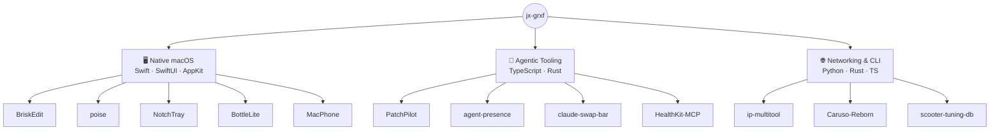

## Hi there, I'm Johannes 👋

📍 **Austria** | 🏫 **HTL Student** | 💻 **Swift, C, Java, JS/TS & AI**

---

## About Me

- 🎓 2nd-year **HTL student** at HTBLA Kaindorf an der Sulm, Austria
- 💻 Learning **C**, **Swift**, **Java**, and **TypeScript / JavaScript**
- 🤖 Interested in **AI development & LLMs**
- 🔧 Experienced in using Codex, Claude Code, and other agentic coding AIs.

---

## What I'm Building

---

## Mac-Apps

| Project | Tech | Platform | Description |
|:---:|:---:|:---:|---|
| ✏️ [BriskEdit](https://github.com/jx-grxf/BriskEdit) |  |  | Native macOS developer text editor built with SwiftUI, AppKit, TextKit 2, and Swift 6. |
| 📱 [MacPhone](https://github.com/jx-grxf/MacPhone) |  |  | macOS device lab with a CoreBluetooth BLE bridge for emulator testing. |
| 🍾 [BottleLite](https://github.com/jx-grxf/BottleLite) |  |  | Open-source macOS runner for Windows apps. |
| 🧍 [poise](https://github.com/jx-grxf/poise) |  |  | Turn your AirPods into a posture coach — native macOS menu bar app that tracks head posture via AirPods motion sensors, fully local (no camera, no cloud). |
| 🔀 [claude-swap-bar](https://github.com/jx-grxf/claude-swap-bar) |  |  | Native macOS menu bar app for switching between Claude Code accounts, with live usage meters. |
| 📲 [NotchTray](https://github.com/jx-grxf/NotchTray) |  |  | Recovers menu bar status items hidden behind the MacBook notch and surfaces them in a Dynamic Island-style dropdown. |

---

## Highlighted Projects

| | | | |
|:---:|:---:|:---:|---|
| 📻 [Caruso-Reborn](https://github.com/jx-grxf/Caruso-Reborn) |   |   | Local streaming bridge that brings internet radio and modern sources back to older T+A Caruso systems through a browsable UPnP workflow. |
| 🛠️ [PatchPilot](https://github.com/jx-grxf/PatchPilot) - BETA |   |   | PatchPilot is a local-first terminal coding agent that helps developers safely inspect, plan, and apply code changes with explicit permission controls for file writes and shell commands using Ollama, Gemini, OpenRouter, NVIDIA, or Codex, with high token efficiency thanks to token-caching. |
| 🌐 [johannesgrof.me](https://github.com/jx-grxf/johannesgrof.me) |  |  | Personal domain website repository. |
| ❤️ [HealthKit-MCP](https://github.com/jx-grxf/HealthKit-MCP) |   |  | Read-only MCP bridge for Apple Health: sleep, workouts, and trends for ChatGPT, Claude, and Codex. |
| 🦀 [agent-presence](https://github.com/jx-grxf/agent-presence) |  |    | Discord Rich Presence for Claude Code and Codex — one static binary, no bot token, shows live what your coding agent is doing. |
| 🧰 [ip-multitool](https://github.com/jx-grxf/ip-multitool) |  |    | Terminal toolkit for IP intelligence, DNS/RDAP lookups, HTTP checks, subnet math, and authorized network diagnostics. |
| 🛴 [scooter-tuning-db](https://github.com/jx-grxf/scooter-tuning-db) |   |  | Open, community-reverse-engineered BLE register and tuning map database for e-scooters. |

---

### Coming soon

| | | | |
|:---:|:---:|:---:|---|
| ⌨️ TypeBot |   |  | stay tuned...👀 |
| 🧰 PortPirate |  |  | Native macOS menu bar control center for monitoring, diagnosing, agent-ports, and managing local developer runtimes. |

---

<b>📦 Archive</b> — unmaintained projects &amp; forks

 

> [!NOTE]
> These repositories are no longer maintained. They stay public for reference,
> but expect no fixes, releases, or support.

**Unmaintained macOS apps**

| Project | Tech | Platform | Description |
|:---:|:---:|:---:|---|
| 🔊 [SlamX](https://github.com/jx-grxf/SlamX) |  |  | Want to make your MacBook scream? |
| 📄 [DocxToPDF](https://github.com/jx-grxf/DocxToPDF) |   |  | Batch convert DOCX documents to PDFs quickly. |

**Unmaintained projects**

| Project | Tech | Platform | Description |
|:---:|:---:|:---:|---|
| 🎧 [Hermes-Discord-Voice](https://github.com/jx-grxf/Hermes-Discord-Voice) |   |  | Discord voice bridge for Hermes Agent. |
| 🎙️ [OpenClaw-Discord-Voice](https://github.com/jx-grxf/OpenClaw-Discord-Voice) |   |  | Self-hosted Discord voice bridge project for OpenClaw experiments. |
| 📡 [arduino-distance-alarm](https://github.com/jx-grxf/arduino-distance-alarm) |   |   | A simple distance measure project for Arduino exposed to a local web dashboard to monitor data. |
| 🛠️ [Digi2PDF](https://github.com/jx-grxf/Digi2PDF) |   |  | Taken down due to legal matters. ⛔️ |

**Forks**

| Project | Tech | Description |
|:---:|:---:|---|
| 📚 [EBookToPDF](https://github.com/jx-grxf/EBookToPDF) |  | Utility repository for converting ebooks into PDF format. |

---

## Tech Stack

**Languages**

**Tools & Platforms**

  

---

## GitHub Stats

---

## Roadmap

- ⚙️ AI Development & Agents
- 📱 macOS apps with Swift
- 🌐 TypeScript / JavaScript
- 🔐 cybersecurity

---

## Fun facts

- 🔥 Burning millions of tokens a day 🦞
- MacBook Pro M2 
- coding is peace 

---

## Socials

